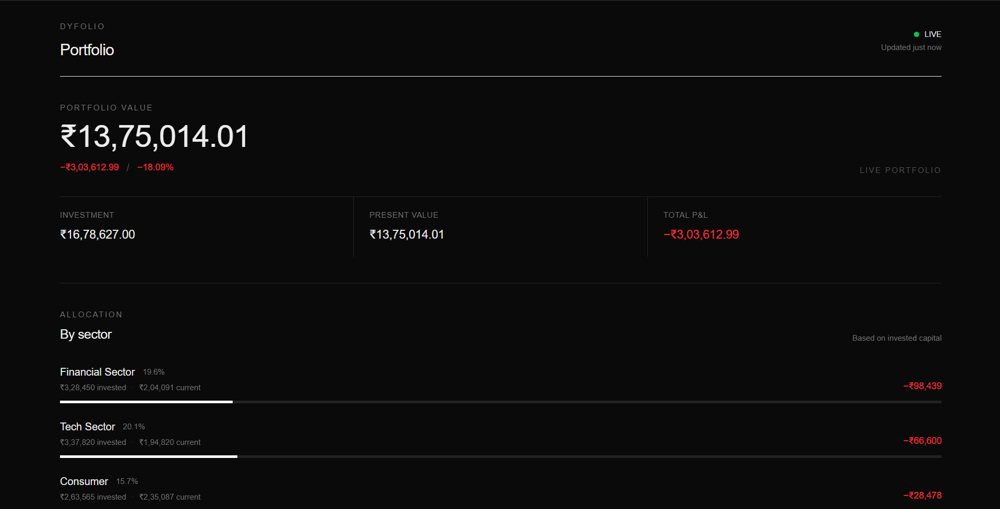
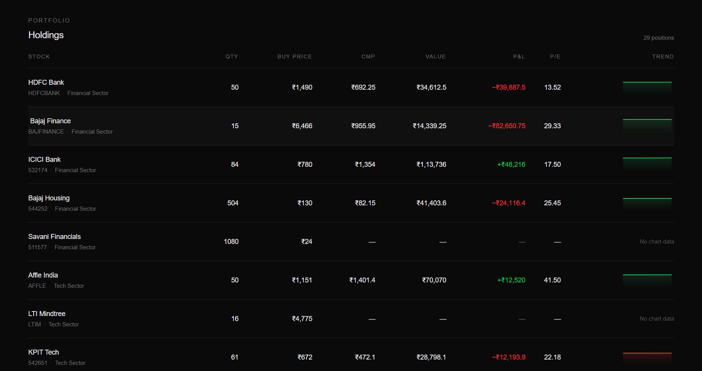

# DyFolio

### Dynamic Portfolio Dashboard for Real-Time Market Tracking

<p align="center">
  <strong>A full-stack portfolio dashboard that combines portfolio holdings, live market data, financial fundamentals, and portfolio analytics in one interface.</strong>
</p>

<p align="center">
  <a href="https://github.com/avyaanverma/dyfolio-website">
    
  </a>
  
  
  
  
  
</p>

<p align="center">
  <a href="#features">Features</a> •
  <a href="#architecture">Architecture</a> •
  <a href="#tech-stack">Tech Stack</a> •
  <a href="#data-flow">Data Flow</a> •
  <a href="#local-development">Development</a> •
  <a href="#deployment">Deployment</a>
</p>

---

## Preview

> Screenshots will be added after the final UI polish and production deployment.

### Dashboard

<p align="center">
  
</p>

### Holdings

<p align="center">
  
</p>

---

## Overview

**DyFolio** is a dynamic portfolio dashboard built for the OctaByte AI full-stack assignment.

The application takes portfolio holdings from an Excel workbook, imports the stable portfolio data into PostgreSQL, and combines it with external market and financial data.

The backend handles the data aggregation and portfolio calculations, while the Next.js frontend focuses on presenting the information through a dark, finance-oriented interface.

```text
Excel
  │
  │ One-time import
  ▼
PostgreSQL
  │
  │ Prisma
  ▼
Node.js + Express
  │
  ├───────────────┐
  ▼               ▼
Yahoo Finance   Google Finance
  │               │
  │ CMP           │ P/E + Earnings
  │ History       │
  └───────┬───────┘
          ▼
   Portfolio Calculations
          │
          ▼
     REST API
          │
          ▼
      Next.js UI
```

---

# Features

### Portfolio Analytics

- Total investment
- Current portfolio value
- Overall gain/loss
- Portfolio allocation percentage
- Individual holding performance
- Sector-level aggregation

### Market Data

- Current Market Price (CMP)
- Historical price data
- NSE stock support
- BSE stock support
- Explicit exchange-to-provider symbol mapping

### Financial Fundamentals

- P/E ratio
- Latest earnings
- Google Finance integration

### Dashboard

- Dark financial-dashboard interface
- Responsive holdings table
- Green/red performance indicators
- Sector summaries
- Compact price charts
- Smooth UI transitions
- Automatic 15-second refresh

### Backend

- REST API
- Prisma + PostgreSQL
- Provider abstraction
- In-memory caching
- Graceful external API failures
- Derived portfolio calculations
- Separate repository/service/controller layers

---

# Tech Stack

## Frontend

| Technology        | Purpose                                   |
| ----------------- | ----------------------------------------- |
| **Next.js**       | React framework and application structure |
| **React**         | UI                                        |
| **TypeScript**    | Type safety                               |
| **Tailwind CSS**  | Styling                                   |
| **Framer Motion** | UI transitions                            |
| **Recharts**      | Price visualizations                      |

## Backend

| Technology         | Purpose                   |
| ------------------ | ------------------------- |
| **Node.js**        | Runtime                   |
| **Express**        | REST API                  |
| **TypeScript**     | Type safety               |
| **Prisma**         | ORM                       |
| **PostgreSQL**     | Portfolio persistence     |
| **yahoo-finance2** | Yahoo Finance integration |
| **XLSX**           | Excel import              |

## Infrastructure

| Technology | Purpose            |
| ---------- | ------------------ |
| **Neon**   | PostgreSQL hosting |
| **Render** | Backend hosting    |
| **Vercel** | Next.js hosting    |

---

# Architecture

DyFolio follows a simple layered architecture.

```text
                         ┌─────────────────────┐
                         │      Next.js        │
                         │       Web App       │
                         └──────────┬──────────┘
                                    │
                              REST API
                                    │
                                    ▼
                         ┌─────────────────────┐
                         │      Express        │
                         │      Controller     │
                         └──────────┬──────────┘
                                    │
                                    ▼
                         ┌─────────────────────┐
                         │   Portfolio Service │
                         │                     │
                         │ Calculations        │
                         │ Aggregation         │
                         │ Provider orchestration│
                         └──────┬───────┬──────┘
                                │       │
                    ┌───────────┘       └───────────┐
                    ▼                               ▼
             ┌──────────────┐               ┌──────────────┐
             │ Repository   │               │  Providers   │
             │              │               │              │
             │ Prisma       │               │ Yahoo        │
             │ PostgreSQL   │               │ Google       │
             └──────────────┘               └──────────────┘
```

The frontend does not communicate directly with Yahoo Finance or Google Finance.

All external data access happens on the backend.

---

# Project Structure

```text
dyfolio-website/
│
├── apps/
│   │
│   ├── web/
│   │   └── src/
│   │       ├── app/
│   │       ├── components/
│   │       │   └── dashboard/
│   │       └── lib/
│   │
│   └── api/
│       ├── prisma/
│       └── src/
│           ├── cache/
│           ├── controllers/
│           ├── lib/
│           ├── providers/
│           ├── repositories/
│           ├── routes/
│           ├── scripts/
│           ├── services/
│           ├── app.ts
│           └── server.ts
│
├── package.json
├── pnpm-workspace.yaml
└── README.md
```

---

# Data Flow

Portfolio data is imported from Excel only once.

```text
┌──────────────────────┐
│   Excel Workbook     │
│   Portfolio Data     │
└──────────┬───────────┘
           │
           │ Import script
           ▼
┌──────────────────────┐
│     PostgreSQL       │
│                      │
│ Stocks               │
│ Holdings             │
└──────────┬───────────┘
           │
           │ Prisma
           ▼
┌──────────────────────┐
│ Portfolio Repository │
└──────────┬───────────┘
           │
           ▼
┌──────────────────────────────┐
│      Portfolio Service       │
│                              │
│ Investment                   │
│ Present Value                │
│ Gain/Loss                    │
│ Portfolio %                  │
│ Sector Aggregation           │
└──────────┬───────────────────┘
           │
           ├───────────────┐
           ▼               ▼
      Yahoo Finance   Google Finance
           │               │
           ▼               ▼
       CMP/History     P/E/Earnings
           │               │
           └───────┬───────┘
                   ▼
             REST Response
                   │
                   ▼
              Next.js UI
```

---

# Database Design

The database intentionally stores **stable portfolio information**.

### Stock

```text
id
name
exchangeCode
sector
```

### Holding

```text
id
stockId
purchasePrice
quantity
```

Relationship:

```text
Stock 1 ───────── 1 Holding
```

### Derived Values

The following values are calculated by the backend:

```text
Investment
Portfolio Percentage
Present Value
Gain/Loss
Sector Totals
```

### External Values

The following values come from external providers:

```text
CMP
P/E Ratio
Latest Earnings
Historical Prices
```

This keeps frequently changing market data separate from the portfolio's persistent state.

---

# Portfolio Calculations

### Investment

```text
Investment = Purchase Price × Quantity
```

### Present Value

```text
Present Value = CMP × Quantity
```

### Gain / Loss

```text
Gain/Loss = Present Value − Investment
```

### Portfolio Percentage

```text
Portfolio % =
Investment / Total Investment × 100
```

### Portfolio Summary

```text
Total Investment
      ↓
Σ Individual Investments

Total Present Value
      ↓
Σ Individual Present Values

Total Gain/Loss
      ↓
Total Present Value − Total Investment
```

---

# External Data Providers

## Yahoo Finance

Used for:

- Current Market Price
- Historical price data

Yahoo symbols are resolved through a dedicated mapping layer.

```text
NSE

HDFCBANK
    ↓
HDFCBANK.NS
```

For BSE numeric identifiers, explicit mappings are maintained:

```text
BSE Code
   ↓
Yahoo BSE Symbol
```

This keeps provider-specific symbol logic outside the core portfolio service.

---

## Google Finance

Used for:

- P/E Ratio
- Latest Earnings

Examples:

```text
NSE

HDFCBANK
    ↓
HDFCBANK:NSE
```

```text
BSE

532174
    ↓
532174:BOM
```

The provider is isolated so that changes in external data extraction do not affect the rest of the application.

---

# Caching Strategy

The dashboard refreshes every **15 seconds**.

However, the application does not blindly request every external data source every 15 seconds.

```text
                    Frontend
                       │
                 Every 15 sec
                       │
                       ▼
                  Express API
                       │
              ┌────────┼────────┐
              ▼        ▼        ▼
           CMP Cache  Google   History
                     Cache      Cache
              │        │        │
              └────────┼────────┘
                       ▼
                 External APIs
```

### Cache strategy

| Data                | Strategy       |
| ------------------- | -------------- |
| CMP                 | Short TTL      |
| Google fundamentals | Longer TTL     |
| Historical prices   | Separate cache |
| Portfolio data      | PostgreSQL     |

The goal is to keep the UI responsive while reducing unnecessary external requests.

---

# API

## Health Check

```http
GET /api/health
```

Example:

```json
{
  "status": "ok",
  "service": "dyfolio-api",
  "timestamp": "2026-..."
}
```

---

## Portfolio

```http
GET /api/portfolio
```

Returns:

```json
{
  "summary": {
    "totalInvestment": 0,
    "totalPresentValue": 0,
    "totalGainLoss": 0
  },
  "sectors": [],
  "holdings": []
}
```

Each holding contains the portfolio information required by the dashboard.

---

# Dynamic Updates

The dashboard automatically refreshes its portfolio data every 15 seconds.

```text
Initial Load
     │
     ▼
GET /api/portfolio
     │
     ▼
Render Dashboard
     │
     ▼
Wait 15 seconds
     │
     ▼
GET /api/portfolio
     │
     ▼
Update Dashboard
     │
     └───────────────► Repeat
```

The polling happens on the frontend while the backend controls external provider request frequency through caching.

---

# Error Handling

External market data is inherently less reliable than the application's own database.

Provider failures are isolated from the rest of the portfolio.

For example:

```text
Yahoo CMP unavailable
        ↓
CMP = null
        ↓
Present Value = null
        ↓
Gain/Loss = null
```

The remaining holdings can still be returned.

This prevents one failed stock/provider request from taking down the entire dashboard.

---

# Engineering Decisions

## Why PostgreSQL instead of reading Excel at runtime?

The Excel file is treated as an **initialization source**, not as a runtime database.

```text
Excel
  ↓
One-time import
  ↓
PostgreSQL
  ↓
Application
```

This makes the deployed application independent of the local workbook.

---

## Why a separate backend?

The frontend should not directly communicate with external financial providers.

The backend handles:

- Provider requests
- Symbol mapping
- Calculations
- Caching
- Error handling
- Database access

This also prevents database credentials and server-side logic from reaching the browser.

---

## Why aren't CMP and P/E stored in PostgreSQL?

They are external, changing values.

The database stores the portfolio's stable state, while providers supply current market information.

---

## Why not Redis?

The current portfolio size does not justify another infrastructure dependency.

An in-memory cache is sufficient for this assignment.

---

## Why not WebSockets?

The requirement is dynamic updates around every 15 seconds.

Polling provides the required behavior with significantly less operational complexity.

---

## Why not microservices?

The application has a small number of clear responsibilities and does not require independent service scaling.

A single Express backend keeps the system easier to understand, deploy, and maintain.

---

# Local Development

### 1. Clone

```bash
git clone https://github.com/avyaanverma/dyfolio-website.git

cd dyfolio-website
```

### 2. Install dependencies

```bash
pnpm install
```

### 3. Configure API environment

Create:

```text
apps/api/.env
```

```env
DATABASE_URL=your_postgresql_connection_string
PORT=5000
```

### 4. Configure frontend environment

Create:

```text
apps/web/.env.local
```

```env
NEXT_PUBLIC_API_URL=http://localhost:5000
```

### 5. Start development

```bash
pnpm dev
```

Local services:

```text
Frontend
http://localhost:3000

Backend
http://localhost:5000
```

---

# Production Architecture

```text
                        Internet
                           │
                           ▼
                  ┌─────────────────┐
                  │     Vercel      │
                  │   Next.js App   │
                  └────────┬────────┘
                           │
                         HTTPS
                           │
                           ▼
                  ┌─────────────────┐
                  │     Render      │
                  │  Express API    │
                  └────────┬────────┘
                           │
              ┌────────────┼────────────┐
              ▼            ▼            ▼
           Neon         Yahoo         Google
        PostgreSQL     Finance       Finance
```

---

# Deployment

### Frontend

**Vercel**

```text
Next.js
     ↓
Vercel
```

### Backend

**Render**

```text
Node.js + Express
        ↓
Render
```

### Database

**Neon**

```text
PostgreSQL
    ↓
Neon
```

---

# Live Links

> Add these after production deployment.

| Resource              | Link                                                              |
| --------------------- | ----------------------------------------------------------------- |
| 🌐 **Live Dashboard** | `https://your-project.vercel.app`                                 |
| ⚡ **Backend API**    | `https://your-api.onrender.com`                                   |
| ❤️ **Health Check**   | `https://your-api.onrender.com/api/health`                        |
| 📊 **Portfolio API**  | `https://your-api.onrender.com/api/portfolio`                     |
| 💻 **GitHub**         | [dyfolio-website](https://github.com/avyaanverma/dyfolio-website) |

---

# Limitations

The assignment uses external financial-data sources that are not guaranteed portfolio APIs.

Potential issues include:

- Provider availability
- Symbol changes
- Rate limits
- Changes in external response formats
- Missing market data for specific securities

The application handles these cases through:

- Provider abstraction
- Explicit symbol mapping
- Caching
- Graceful `null` values
- Backend error handling

---

# Scope

DyFolio intentionally focuses on the requirements of the portfolio dashboard.

It does **not** implement:

- Authentication
- Multiple users
- Multiple portfolios
- Brokerage integration
- Buy/sell execution
- Transaction management
- Order management
- Redis
- Kafka
- WebSocket infrastructure
- Microservices

These were intentionally excluded to keep the system proportional to the problem.

---

# Assignment Coverage

| Requirement            | Status |
| ---------------------- | :----: |
| Next.js frontend       |   ✅   |
| Node.js backend        |   ✅   |
| TypeScript             |   ✅   |
| PostgreSQL             |   ✅   |
| Yahoo Finance          |   ✅   |
| Google Finance         |   ✅   |
| Portfolio calculations |   ✅   |
| Sector summaries       |   ✅   |
| Dynamic updates        |   ✅   |
| Caching                |   ✅   |
| NSE/BSE support        |   ✅   |
| Error handling         |   ✅   |
| Responsive dashboard   |   ✅   |
| Historical charts      |   🔄   |
| Production deployment  |   🔄   |
| Demo video             |   🔄   |

---

# Documentation

Additional technical documentation:

- [`Technical Documentation`](./TECHNICAL_DOCUMENTATION.md)
- [`Demo Video Script`](./VIDEO_SCRIPT.md)

---

# Built With

<p align="center">


</p>

---

<p align="center">
  <strong>DyFolio</strong>
  <br />
  Dynamic portfolio tracking with a simple, focused architecture.
</p>

<p align="center">
  Built by <a href="https://github.com/avyaanverma">Avyaan Verma</a>
</p>
